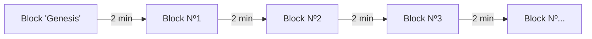
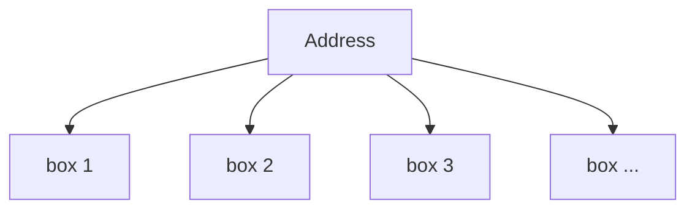
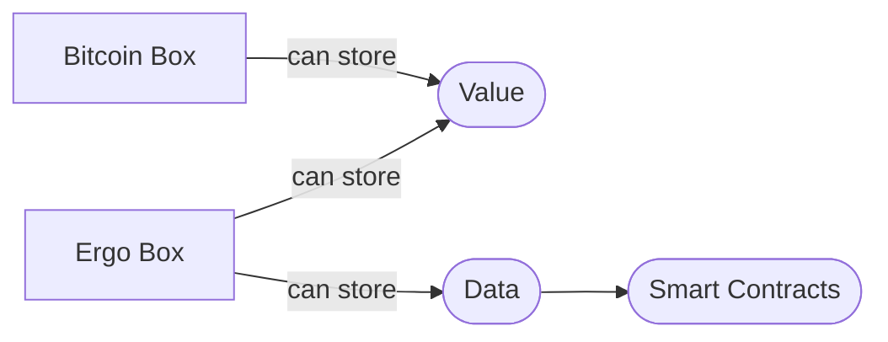
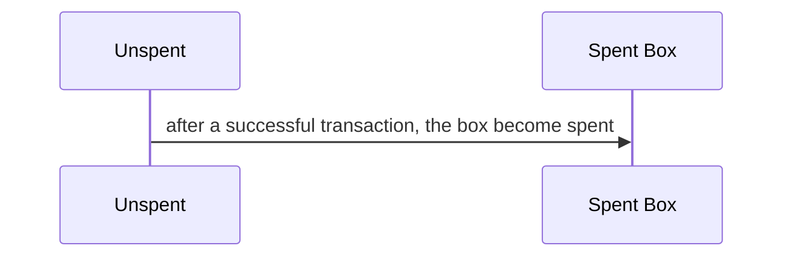

# Blockchain 101

```text title="Completion Status"
Version: 1st Version
Question from Kii: I think this is an interesting part of development. Because it is generic yet it is somehow important. The question we should ask ourselves is not if we're actually have the right information for what Blockchain is, because there are other resources out there that can provide way better information as compared to what we can provide. The question to ourselves is, what information should be put into this article that can really benefit the students who are here to learn about Ergo dApp development.
```

## What is a Blockchain?

A blockchain can be seen as an immutable ledger that has the history of all transactions that ever existed on that blockchain. These transactions are completed in **Blocks**.

Depending on the blockchain, they can store Value (Bitcoin network) or Value and data that allows it to conduct smart transactions (Ergo, Ethereum, Cardano), whereby smart transactions are transactions that are given rules and therefore can only be executed in certain manners.

It can be viewed as a decentralized ledger where all the information that is stored on it, are immutables, meaning that all information, once confirmed by the protocol, becomes unchangeable.

It enables people to share and verify information securely and transparently. It operates like a digital ledger where data is stored in blocks that are linked to the previous block, creating a chain of information. Once data is added to the blockchain, it can't be changed or deleted, making it a trustworthy and reliable record of information.

## What are the benefits of blockchain?

One of the main advantages of blockchain is that it eliminates the need for intermediaries or trusted third parties to validate transactions. This means that parties can transact with each other directly and securely without the need for a middleman. Other benefits of blockchain include:

Ensuring data privacy and security: Blockchain can be used to store and share sensitive data in a secure and transparent manner, making it ideal for applications that require high levels of data privacy and security.

Reducing fraud and corruption: Blockchain can help prevent fraud and corruption by providing a tamper-proof record of all transactions, making it difficult for bad actors to manipulate the data.

## Improving transparency and accountability: Blockchain can enhance transparency and accountability by providing a transparent and immutable record of all transactions, making it easier to track and audit transactions.

## What is a Block?

A block can be defined as a group of transactions, where generally multiple transactions at a single point in time are stored together thus forming one block.

In Ergo the first block is called 'Genesis' and each block is created with approximately 2 minutes interval between.



---

## What is an Address?

An eUTXO address is a container where one or more **boxes** are stored, that can hold value or data.

The address can be considered as a reference for all your boxes on the network and to access it, you must provide a valid combination of Public and Private keys.



---

## What is a Box?

In the eUTxO system, boxes are virtual containers that hold tokens and other data. Each box represents a unit of value or a token on the blockchain. Boxes can hold one or more tokens, and they can be created, consumed, and modified by transactions.

When a transaction is created on the eUTxO system, it consumes one or more input boxes and creates one or more output boxes. The input boxes represent the tokens or values being spent, and the output boxes represent the new tokens or values being created as a result of the transaction.

Boxes can also be used to enforce rules and conditions on the blockchain network. For example, a box can be created with certain spending conditions, such as requiring a specific password or signature to spend the tokens. This can be useful in creating more complex transactions and enforcing security on the network.

Overall, boxes are a key concept in the eUTxO system, as they represent the units of value and tokens being transacted on the network. By using boxes, developers can create powerful and flexible applications that can be customized to meet a wide range of needs and requirements.



---

## What is a Smart Contract?

Smart contracts are self-executing computer programs that run on the blockchain network. They are essentially a set of rules and conditions that govern how a transaction will be executed. Smart contracts are ideal for a wide range of applications, including financial transactions, supply chain management, and more, as they eliminate the need for intermediaries and provide a high level of security and transparency.

It is on-chain code that upon a successful validation, is executed on the blockchain creating a smart **transaction**.

In Ergo a smart contract is also called a Guard Script.

---

## What is a Transaction(Tx)?

A transaction(TX for short) is when an exchange of Value/Data occurs, in this case, on a decentralized ledger.

In the eUTXO model, a transaction need to have **Input** and will always have an **Output**.

When a TX is successfully added to a block:

- The Input is considered as "spent boxes".
- The Output is considered as "unspent boxes".

To be a valid transaction, along with the Guard Script validation, it must follow the most basic rule: "the sum of the Input must be equal to the sum of the Output".

In Ergo, the minimum for a transaction to be successful is 0,001 ERG.

Then the transaction is added to the current network block and then a block to be successfully added to the full blockchain needs to be correctly **validated/secured** by the Network Miners.



---

## Where comes the Validation/Security?

There are many Blockchains _consensus_ and each one has its own features but the most common are PoS and PoW.

The block validation is taken care different if:

- is Proof-of-Stake (PoS) the validation is taken care by Node validators/operators.
- is Proof-of-Work (PoW) the validation is taken care by Miners.

Ergo is a Proof-of-Work(PoW) blockchain where Miners are an important part to maintain the security of the network.
By security what is meant is that Miners provide Hardware (GPU's) that calculates long mathematical problems to ensure the correct continuity of chain.

Is with this consensus that the blockchain remains secure without bad actors modifying blocks at own will.

---

## Test your knowledge

### Can Ergo be considered a decentralized ledger?

Yes!
Ergo is based on Blockchain technology which inherits all characteristics like decentralized ledger.

### What type of boxes are created after a TX?

Ergo creates two types of boxes:
The "unspent boxes" and the "spent boxes"

### What type of information can Ergo Blockchain store?

Ergo Blockchain supports natively the following type:
Value and Data.

---

## Conclusion

Blockchain is a decentralized and immutable ledger that stores all the transactions history.

Has features like:

1. Decentralized
2. Secure
3. Transparent
4. Immutable

And allows to:

1. Be used as currency
2. Be a store of value
3. Create multiple projects on top of this features

```text title="Cabin Sessions"
Throughout this article, we discussed about what is Blockchain technology. Ask each Cabin Members about
1. What they understand Blockchain
2. Describe Blocks in their own words
3. What kind of application can be or already has being implemented via Blockchain
4. Discuss members opinions and give one exemple too. Blockchain is used for tracking token prices like "Ergo Oracle pools"
```

In the next topic we will discuss more about **What is Ergo?**
