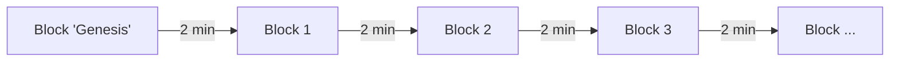

# Blockchain 101

```text title="Completion Status"
Version: 1st Version
Question from Kii: I think this is an interesting part of development. Because it is generic yet it is somehow important. The question we should ask ourselves is not if we're actually have the right information for what Blockchain is, because there are other resources out there that can provide way better information as compared to what we can provide. The question to ourselves is, what information should be put into this article that can really benefit the students who are here to learn about Ergo dApp development.
```

### What is a Blockchain?

A blockchain can be seen as an immutable ledger that has the history of all transactions that ever existed on that blockchain. These transactions are completed in **Blocks**.

Depending on the blockchain, they can store Value (Bitcoin network) or Value and data that allows it to conduct smart transactions (Ergo, Ethereum, Cardano), whereby smart transactions are transactions that are given rules and therefore can only be executed in certain manners.

It can be viewed as a decentralized ledger where all the information that is stored on it, are immutables, meaning that all information, once confirmed by the protocol, becomes unchangeable.

---
### What is a Block?

A block can be defined as a group of transactions, where generally multiple transactions at a single point in time are stored together thus forming one block.

In Ergo the first block is called 'Genesis' and each block is created with approximately 2 minutes interval between.



---
### What is an Address?

An eUTXO address is a container where one or more **boxes** are stored, that can hold value or data.

The address can be considered as a reference for all your boxes on the network and to access it, you must provide a valid combination of Public and Private keys.


---
### What is a Box?

A box is a simple container for Value and Data. 
Each Blockchain have different sections and criteria for the box creation but the most common are:

- Value
  - Section in which the transaction value is stored in its native form 
- Data
  - Section in which the transaction data is stored in form of a **Smart Contract**

Natively, Bitcoin only allow to store Value while Ergo allows to store Value and Data.


---
### What is a Smart Contract?

A smart contract is an on-chain code that upon a successful validation, is executed on the blockchain creating a smart **transaction**.

In Ergo the smart contract is called "Guard Script".

---
### What is a Transaction(Tx)?
A transaction(TX for short) is when an exchange of Value/Data between two or more Addresses occurs.

- In the Account model, a transaction only need to have **Input**.
  - The Input can be the amount to send.
- In the eUTXO model, a transaction need to have **Input** and will always have **Output**.
  - The Output is what is considered the "change" meaning what's left in native token.

To be a valid transaction, along with the GuardScript validation, it must follow the most basic rule: "the sum of the Input must be equal to the sum of the Output".

In Ergo, the minimum for a transaction to be successful is 0,001 ERG.

When a transaction is successful, the input box is called "spent box" and output boxes is called "unspent boxes"

Then the transaction is added to the current network block and then a block to be successfully added to the full blockchain needs to be correctly **validated/secured** by the Network Miners.


---
### Where comes the Validation/Security?

There are many Blockchains _consensus_ and each one has its own features but the most common are PoS and PoW.

The block validation is taken care different if:
- is Proof-of-Stake (PoS) the validation is taken care by Node validators/operators.
- is Proof-of-Work (PoW) the validation is taken care by Miners. 

Ergo is a Proof-of-Work(PoW) blockchain where Miners are an important part to maintain the security of the network.
By security what is meant is that Miners provide Hardware (GPU's) that calculates long mathematical problems to ensure the correct continuity of chain.

Is with this consensus that the blockchain remains secure without bad actors modifying blocks at own will.  

---
### Test your knowledge
<details> 
<summary> <strong>&nbsp;Can Ergo be considered a decentralized legder? </strong> </summary>
&emsp;<underline>Yes!</underline> <br>
&emsp;Ergo is based on Blockchain technology which inherits all characteristics like decentralized ledger.<br>

</details>

---

In the next topic we will discuss more about __What is Ergo?__