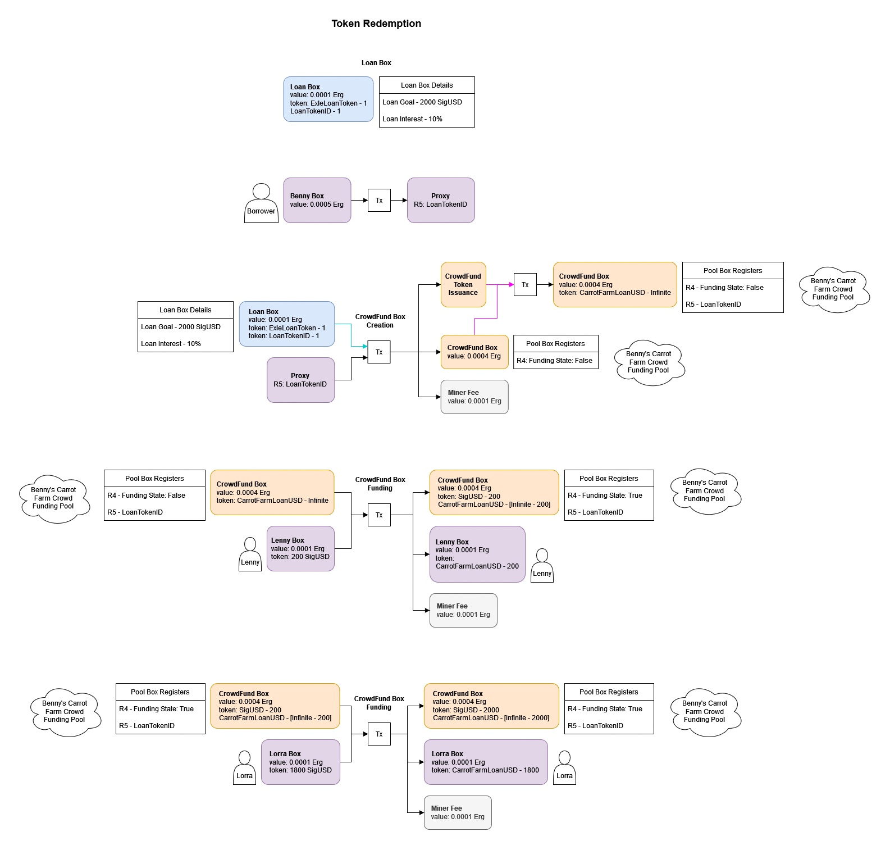
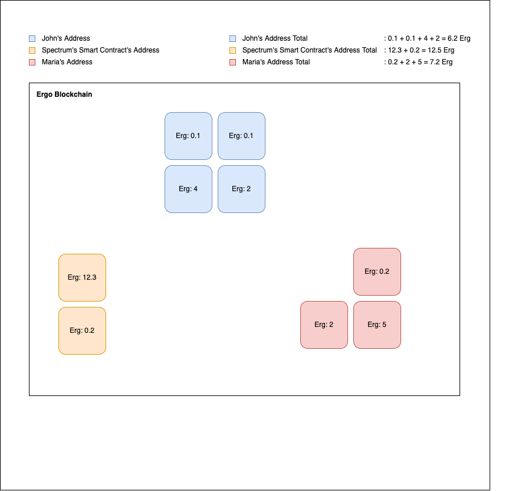

# Lesson 1: Knowledge - eUTxO, Boxes, Addresses

## What is eUTxO

eUTxO stands for "extended Unspent Transaction Output," which is just a fancy way of saying it's a way to keep track of who owns what in a blockchain.

Think of it like a big digital piggy bank. Whenever someone wants to send some digital money to someone else, they put it in the piggy bank. But instead of one big pile of money, there are lots of little piles called "transaction outputs." Each pile has a certain amount of money in it and belongs to a specific person.

Now, let's say someone wants to spend some of their money. They have to break open one of their piles and take out the amount they want to spend. But they can't just take out any amount - they have to take out the exact amount they want to spend, no more and no less.

And here's where eUTxO comes in. It's a set of rules (Smart Contracts) that helps make sure everyone plays fair. It makes sure that people can only spend the exact amount they have in their piggy bank, and that they can only send that money to one person at a time. It also helps keep track of all the transactions, so everyone can see who owns what at any given time.

So basically, eUTxO is a set of rules that helps keep the digital piggy bank fair and transparent for everyone who uses it.

### How Smart Contracts come into play

Let's say you want to create a smart contract that pays out a certain amount of digital money to someone if a certain condition is met. For example, let's say you want to create a contract that pays out 10 digital coins to your friend if the temperature outside reaches 90 degrees Fahrenheit.

With eUTxO, you can create this smart contract as a transaction output. You would create a new pile in the digital piggy bank that has 10 digital coins in it, and you would attach a script to that pile that says "this money can only be spent if the temperature outside is 90 degrees Fahrenheit or higher."

Now, let's say the temperature does reach 90 degrees Fahrenheit. Your friend can then spend the money in that pile by creating a new transaction that satisfies the conditions of the script. The transaction would include a proof that the temperature did in fact reach 90 degrees Fahrenheit, and the digital money would be transferred to your friend's digital wallet.

But if the temperature doesn't reach 90 degrees Fahrenheit, your friend wouldn't be able to spend the money in that pile, because the conditions of the script wouldn't be satisfied. The money would stay in the pile, and everyone would be able to see that the conditions weren't met.

## Boxes

In the Ergo blockchain, a box is another term for an unspent transaction output (UTxO). Remember how I explained the digital piggy bank and the transaction outputs earlier? Well, a box is just another name for one of those transaction outputs.

But boxes in the Ergo blockchain are a little bit more than just transaction outputs. They are a fundamental building block of the blockchain's architecture and are used to represent not just digital money, but also other types of assets or tokens.

Each box contains some digital money or other assets, and also includes a script that specifies the conditions under which that money or assets can be spent. This script is called a "guardian" script, and it's what enforces the rules of the transaction.

For example, a box might contain some digital money and be guarded by a script that says "this money can only be spent after a certain date." Or it might contain a token that represents ownership of a certain asset, and be guarded by a script that says "this token can only be spent by the owner of the corresponding physical asset."

Boxes in the Ergo blockchain are also designed to be flexible and extensible. They can include additional metadata that describes the contents of the box, as well as other attributes that help to optimize the way that the blockchain stores and processes them.

It allows developers to create complex smart contracts and represent a wide range of assets and tokens on the blockchain.

**Here are some examples of transactions, and boxes as representation of UTxOs**

These are very confusing at first look. And it should. As we progress forward, these will start making sense. So don't sweat it.

## What are Addresses?

In the Ergo blockchain, an address is a way to identify a specific box on the blockchain. You can think of an address as a digital "label" that points to a particular box and indicates who has the right to spend the money or assets contained in that box.

Addresses are created by taking the guardian script of a box and running it through a hashing algorithm. The resulting hash value is then encoded in a specific format that is recognized by the Ergo blockchain.

When someone wants to send money or assets to another person on the Ergo blockchain, they create a new box and attach a guardian script to it that specifies the conditions under which that money or assets can be spent. They then generate an address for that box by hashing the guardian script and encoding the result in the specified format.

The sender can then transfer the money or assets to the address by creating a new transaction that includes the address as the recipient. The transaction specifies the amount of money or assets to be transferred, and includes a proof that the sender has the right to spend the money or assets they are transferring.

When the transaction is validated and added to the blockchain, the recipient can then spend the money or assets by creating a new transaction that satisfies the conditions of the guardian script attached to the box associated with the address.

In the figure above, we see that there exist many boxes in the blockchain. Each with different values and is assigned to an address. The total amount of Ergs for each address is all of the boxes added together.

### A great article to facilitate understanding:

[Learning Ergo 101: eUTxO explained for Human Beings by David Przybilla](https://dav009.medium.com/learning-ergo-101-blockchain-paradigm-eutxo-c90b0274cf5e)
